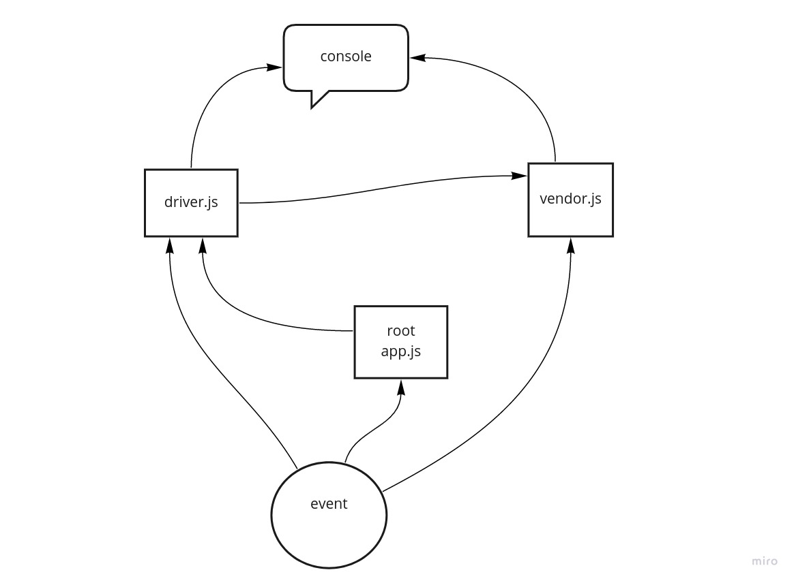

# caps

##### CAPS Phase 1: Begin the build of an application for a company called CAPS - The Code Academy Parcel Service. In this sprint, we’ll build out a system that emulates a real world supply chain. CAPS will simulate a delivery service where vendors (such a flower shops) will ship products using our delivery service and when our drivers deliver them, be notified that their customers received what they purchased.

### output

```
EVENT {
  event: 'pick',
  time: '2021-07-12T12:54:34.283Z',
  payload: {
    store: 'BBR Resturant',
    orderID: 'd4f8adac-a61a-44ac-b876-20a9cc41b644',
    customer: 'Ramiro Hudson',
    address: 'Flatley Lodge'
  }
}
DRIVER:picked up d4f8adac-a61a-44ac-b876-20a9cc41b644 at 2021-07-12T12:54:34.289Z
EVENT: in transit {
  store: 'BBR Resturant',
  orderID: 'd4f8adac-a61a-44ac-b876-20a9cc41b644',
  customer: 'Ramiro Hudson',
  address: 'Flatley Lodge',
  time: '2021-07-12T12:54:37.292Z'
}
DRIVER: delivered up d4f8adac-a61a-44ac-b876-20a9cc41b644 at 2021-07-12T12:54:40.293Z
VENDOR: delivered up d4f8adac-a61a-44ac-b876-20a9cc41b644 at 2021-07-12T12:54:40.293Z
EVENT {
  store: 'BBR Resturant',
  orderID: 'd4f8adac-a61a-44ac-b876-20a9cc41b644',
  customer: 'Ramiro Hudson',
  address: 'Flatley Lodge',
  time: '2021-07-12T12:54:40.293Z'
}
```


### uml

